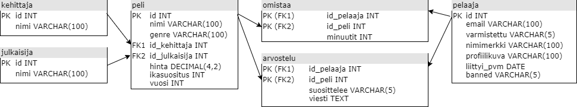

# Höyry
Aja sovellus Visual Studio 2019 avulla. Tarkemmat käyttöohjeet sovelluksessa. Kehitetty windowsille.
## Videodemo
Videodemo siltä varalta ettet saa ajaettua sovellusta paikallisesti: https://m3.jyu.fi/jyumv/Members/anvemaha-40jyu.fi/188487
### Blogipostaus
Käytin apuna seuraavaa blogipostausta: https://zetcode.com/csharp/postgresql/. Siinä tosin ei puhuta yhteyksien sulkemisesta, joten voi olla mahdollista että siinä on paljon muutakin pielessä. Sovellus on kuitenkin kohtuullisen toimiva vaikka saattaakin joissain skenaarioissa kaatua.

## Tietokannan rakenne


Ohjelma rakennettu oletuksella, että käyttäjällä `hoyry` salasanalla `hl3` on osoitteessa `192.168.1.23` olevassa tietokannassa `tjta3501` seuraavia oikeuksia:
- SELECT kaikissa
- INSERT omistaa, arvostelu
```
sudo su postgres
psql tjta3501
CREATE USER hoyry WITH PASSWORD 'hl3' LOGIN;
GRANT SELECT ON kehittaja, julkaisija, peli, pelaaja TO hoyry;
GRANT SELECT, INSERT ON omistaa, arvostelu TO hoyry;
```

## Osio: Sovellusohjelman toteutus (tehtävänanto)
- Oppimistavoite: tietokannan ja tietokannanhallintajärjestelmän ymmärtäminen osana tietokantajärjestelmää.
    - Toteuta pienimuotoinen sovellusohjelma, joka käyttää tietokantaasi.
    - Ohjelman täytyy olla interaktiivinen (ei riitä että se hakee kannasta jotain ja näyttää sen).
    - Toteuta vähintään 5 tietokantaoperaatiota, joista ainakin 2 on kirjoitusoperaatioita.
    - Voit itse valita ohjelmointikielen ja tavan toteuttaa kyselyt.

Palauta sovellusohjelmasi lähdekoodi tai linkki siihen (esim. Github)